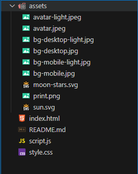

# 🔗 DevLinks

DevLinks é um **agregador de links** que funciona como um cartão de visitas online — ideal para compartilhar seus principais links (portfólio, redes sociais, blog etc.) de maneira simples, elegante e acessível.

---

## 🧩 Tecnologias utilizadas

- HTML5  
- CSS3  
- JavaScript (vanilla)  
- Git & GitHub  
- Figma (para layout/design)  

---

## 📂 Estrutura do projeto

